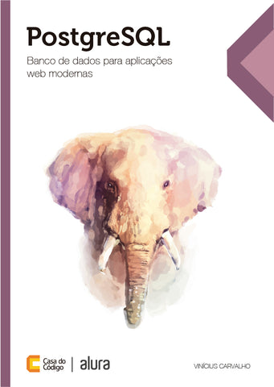

# Livro - PostgreSQL: Banco de dados para aplicações web modernas

Autor: Vinícius Carvalho 

Editora: Casa do Código

Tecnologias de banco de dados dão suporte diário para operações e tomadas de decisões nos mais diversos níveis da empresa, da operação à gerência. Eles são vitais para as organizações modernas que querem se manter competitivas no mercado e no cenário atual de extrema concorrência. O PostgreSQL é um poderoso sistema gerenciador de banco de dados objeto-relacional de código aberto. Seu recente aumento de popularidade veio de usuários de outros bancos de dados em busca de um sistema com melhores garantias de confiabilidade, melhores recursos de consulta, mais operação previsível, ou simplesmente querendo algo mais fácil de aprender, entender e usar.

Neste livro, Vinícius Carvalho explora as principais características do PostgreSQL, mostrando por que ele é seguro, poderoso, confiável e rápido. Através do desenvolvimento de um projeto, você vai aprender na prática as funções, consultas e administração de um banco de dados, podendo revisar seus conhecimentos nos exercícios elaborados pelo autor ao fim do livro.

## Conteúdo do repositório

Durante a leitura do livro **PostgreSQL: Banco de dados para aplicações web modernas**, armazenei as instruções e comandos realizados, para utilizar como referência futura, além de compartilhar com outras pessoas interessadas.

**Arquivos disponíveis**

[001 - Instalação do PostgreSQL no Ubuntu](001_Instalação_do_PostgreSQL_no_Ubuntu.md)

[002 - Tipos de Campos para Armazenar Informações](002_Tipos_de_Campos_para_Armazenar_Informações.md)

[003 - Criar e Alterar Tabelas Índices e Chaves](003_Criar_e_Alterar_Tabelas_Índices_e_Chaves.md)

[004 - Inserir, alterar e excluir registros](004_Inserir_alterar_e_excluir_registros.md)

[005 - Criar alterar e excluir Functions](005_Criar_alterar_e_excluir_Functions.md)

[006 - Operadores lógicos e de comparação](006_Operadores_lógicos_e_de_comparação.md)

[007 - Funções para matetática texto data e hora](007_Funções_para_matetática_texto_data_e_hora.md)

[008 - Funções agregadoras](008_Funções_agregadoras.md)

[009 - Formatação de textos](009_Formatação_de_textos.md)

[010 - Consultas com LIKE e ILIKE](010_Consultas_com_LIKE_e_ILIKE.md)

[011 - Criar e utilizar triggers](011_Criar_e_utilizar_triggers.md)

[012 - Subconsultas](012_Subconsultas.md)

[013 - JOIN](013_JOIN.md)

[014 - Utilização de views](014_Utilização_de_views.md)

[015 - Criar usuários no banco de dados](015_Criar_usuários_no_banco_de_dados.md)

[016 - Realizar o backup e a restauração dele no banco de dados](016_Realizar_o_backup_e_a_restauração_dele_no_banco_de_dados.md)

[017 - Importar arquivos CSV](017_Importar_arquivos_CSV.md)

[018 - Índices e performance das consultas](018_Índices_e_performance_das_consultas.md)

[019 - Tipo de dados especial - Array](019_Tipo_de_dados_especial_Array.md)

[020 - Tipo de dados especial - JSON](020_Tipo_de_dados_especial_JSON.md)

## Quem pode contribuir?

Qualquer desenvolvedor pode contribuir, sendo muito bem-vindo!

## Pessoas Desenvolvedoras

[Diego Mendes Rodrigues](mailto:diego.m.rodrigues@gmail.com)

## Licença

[MIT](LICENSE.md)
